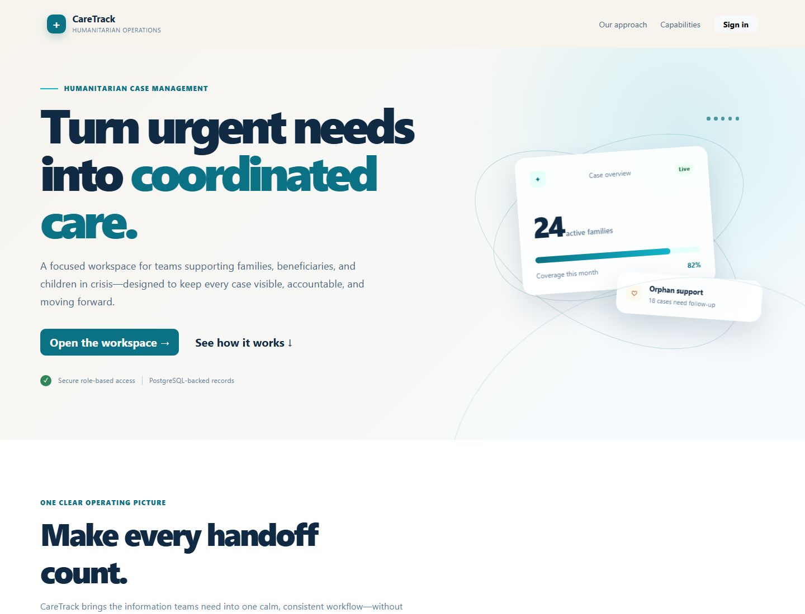

# CareTrack — Emergency Orphan & Family Beneficiary Management System

Humanitarian Case Management & Aid Tracking Platform.

## Overview

A Laravel/PostgreSQL portfolio application for secure internal management of vulnerable families, beneficiaries, orphan records, and aid distributions. The public landing page introduces the product, while the authenticated workspace supports day-to-day case operations.

## Features

- Session authentication with admin, data-entry, and viewer roles
- PostgreSQL relational schema with foreign keys, indexes, and soft deletes
- Family case search, filters, pagination, CRUD, relationships, and audit trail
- Beneficiary and orphan CRUD, aid distribution workflows, reports, CSV export, and admin audit logs
- Bootstrap Blade interface and GitHub Actions PostgreSQL CI
- Responsive public landing page and accessible operations workspace
- Admin user management, inactive-account protection, security headers, and login rate limiting

## Tech Stack

PHP 8.4, Laravel 13, PostgreSQL 16, Eloquent, Blade, Bootstrap 5, PHPUnit, GitHub Actions, FrankenPHP.

## Installation

```bash
cp .env.example .env
composer install
php artisan key:generate
php artisan migrate --seed
php artisan test
npm install
npm run build
```

Set `DB_CONNECTION=pgsql` and the PostgreSQL connection variables in `.env`.

## Demo Accounts

These are fictional demo credentials only:

| Role | Email | Password |
|---|---|---|
| Admin | admin@example.com | password |
| Data Entry | dataentry@example.com | password |
| Viewer | viewer@example.com | password |

## Database Architecture

See [docs/ERD.md](docs/ERD.md). Tables include users, families, beneficiaries, orphans, aid_distributions, and audit_logs. Query examples are documented in [docs/REPORT_QUERIES.md](docs/REPORT_QUERIES.md).

## CI and Deployment

GitHub Actions runs Composer, PostgreSQL migrations/seeding, route validation, and tests on every push. The manual `production-migrate.yml` workflow runs the safe production sequence `php artisan migrate --force` followed by `php artisan db:seed --force`; it never uses `migrate:fresh` against production. `Dockerfile.vercel` provides a production FrankenPHP image.

Production environment values are stored in Vercel, including `APP_ENV=production`, `APP_DEBUG=false`, a generated `APP_KEY`, `DB_CONNECTION=pgsql`, and the Neon connection variables. Laravel accepts Vercel/Neon `DATABASE_URL` and remains compatible with legacy `DB_URL`.

## Live Demo

Production: https://emergency-beneficiary-management-nizar9.vercel.app

Vercel project: `emergency-beneficiary-management` (renamed from the autogenerated project name while preserving the GitHub integration).

The production image uses FrankenPHP and builds the Vite assets in a Node builder stage. Neon PostgreSQL is connected through Vercel environment variables. `DATABASE_URL` is preferred, with `LARAVEL_DATABASE_URL`, `DATABASE_URL_UNPOOLED`, and legacy `DB_URL` compatibility retained in Laravel configuration. See [docs/DEPLOYMENT.md](docs/DEPLOYMENT.md).

## Screenshots

Final visual checks cover the public landing page, the dashboard, and the mobile navigation at 375px, 768px, and 1440px. The latest captures are stored in `docs/screenshots/`.




## Security

All demonstration records are fictional. Before real humanitarian use, add HTTPS, managed secrets, encrypted backups, stronger password policy, restricted database access, monitoring, retention policy, and formal privacy controls. Never commit `.env` or credentials.

See [docs/SECURITY.md](docs/SECURITY.md) for the implemented controls and production hardening checklist.

## Disclaimer

This is a portfolio/demo implementation and is not a substitute for an operational humanitarian information-security review.
