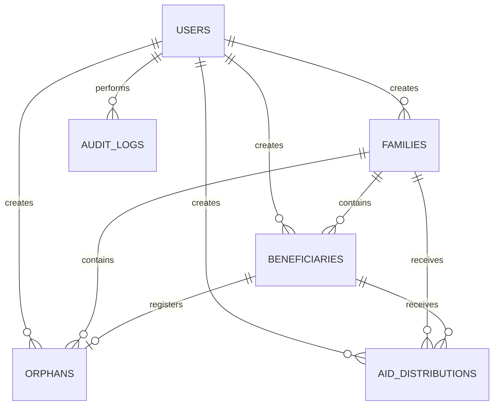

# Data model

```mermaid
erDiagram
 USERS ||--o{ FAMILIES : creates
 USERS ||--o{ BENEFICIARIES : creates
 USERS ||--o{ ORPHANS : creates
 USERS ||--o{ AID_DISTRIBUTIONS : creates
 FAMILIES ||--o{ BENEFICIARIES : contains
 FAMILIES ||--o{ ORPHANS : contains
 BENEFICIARIES ||--o| ORPHANS : registers
 FAMILIES ||--o{ AID_DISTRIBUTIONS : receives
 BENEFICIARIES ||--o{ AID_DISTRIBUTIONS : receives
 USERS ||--o{ AUDIT_LOGS : performs
```

Core records use foreign keys, searchable indexes, and soft deletes for sensitive operational entities.
